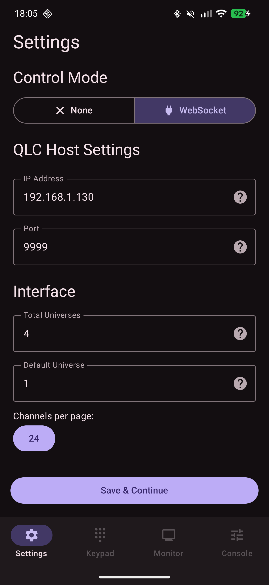

# Introduction
This is a 3rd party Android app built to emulate some features from the QLC+ web interface but on a native phone/tablet application.

It uses a WebSocket connection exposed by QLC+ desktop software (when enabled) to read and write channel changes, function status and DMX keypad data from the host.

The app is built to be very versatile in preferences because it supports many extended features. The UI is built using Google's material framework and Jetpack compose.

Theming is synced with the phone itself, drawing accent colors from whatever "Material You" settings you have enabled globaly.

# Features
Currently, the following features are quite/fully implemented:
- DMX keypad
- DMX monitor
- "Simple Desk" style fader panel
- Multi-fixture selection
- Basic multi-fixture animations

# UI screenshots
<table>
  <tr>
    <td></td>
    <td></td>
    <td></td>
    <td></td>
  </tr>
</table>

# How to install
There are release APKs listed in the release section of this very repo.

# Credits
Thanks so much to the amazing QLC+ team for their continued work on the desktop version of QLC+ (of which this is a controller for).

Please note that since this is an unofficial app, any issues should not be raised with the main QLC+ project.
