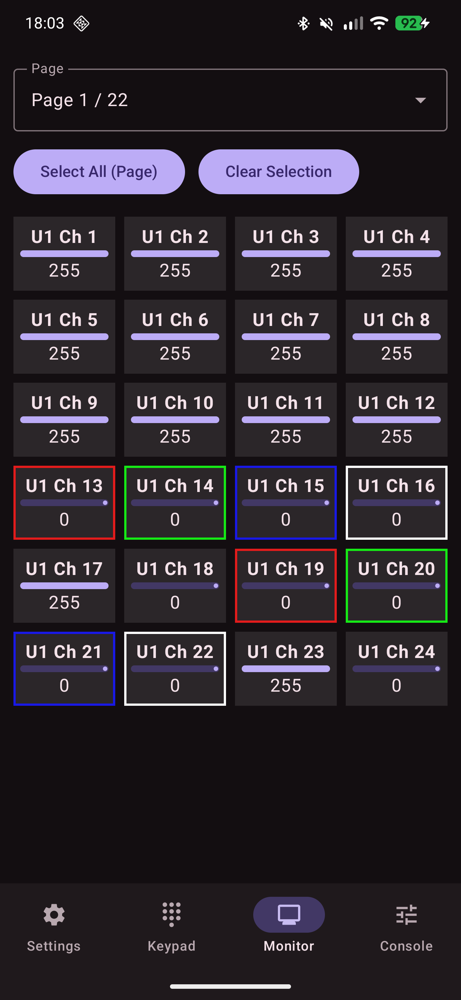
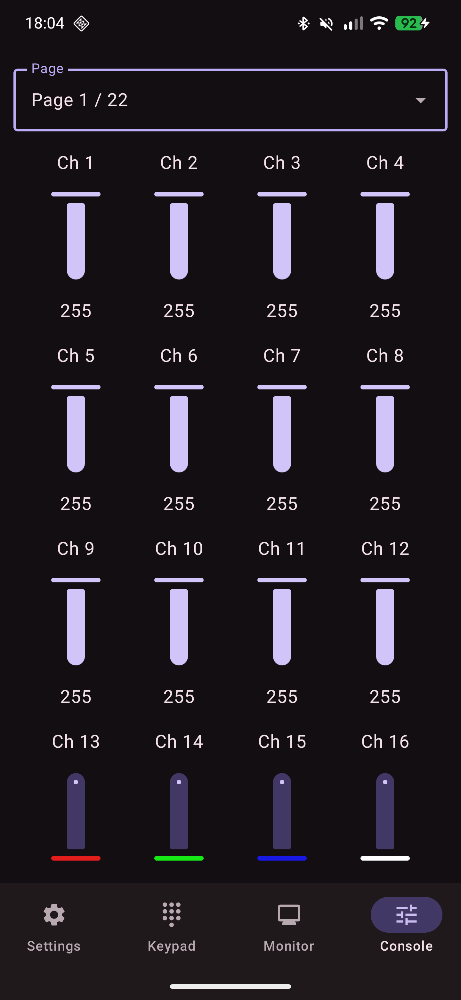
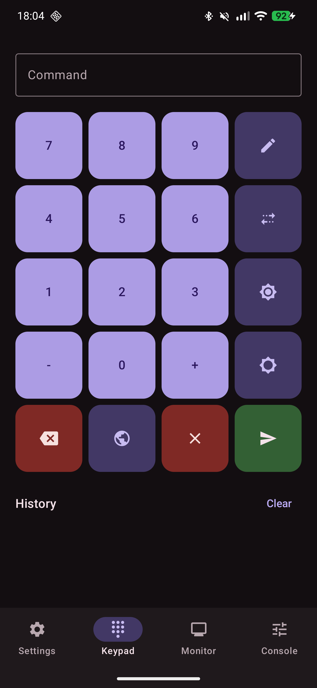
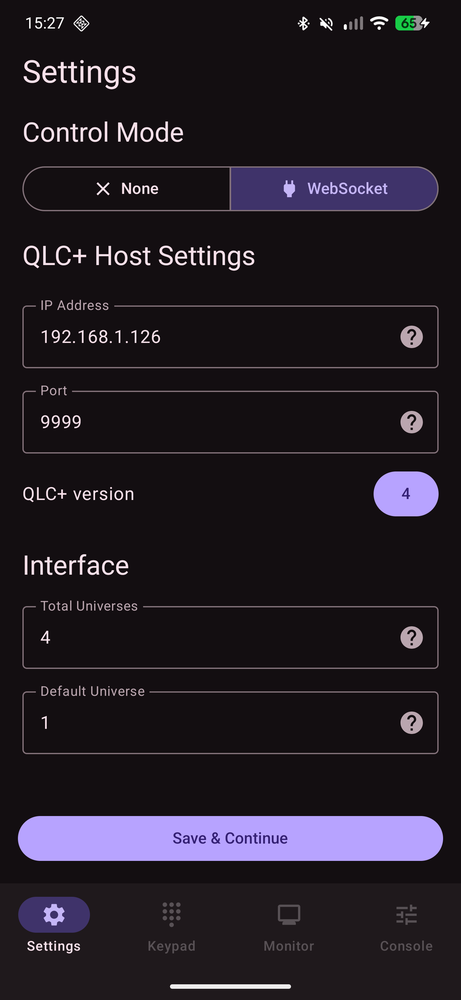

# Controller for QLC+
This is a 3rd party Android app built to emulate some features from the QLC+ web interface but on a native phone/tablet application.

It uses a WebSocket connection exposed by QLC+ desktop software (when enabled) to read and write channel changes, function status and DMX keypad data from the host.

The app is built to be very versatile in preferences because it supports many extended features. The UI is built using Google's material framework and Jetpack compose.

Theming is synced with the phone itself, drawing accent colors from whatever "Material You" settings you have enabled globaly.

At the moment, both v4 and v5 are supported (web interface must be enabled) but I have been told that v5 is very much in development and is likely to change.
For this reason, only v4 is recommended to use with this app.

# Features
Currently, the following features are quite/fully implemented:
- DMX keypad
- DMX monitor
- "Simple Desk" style fader panel
- Multi-fixture selection
- Basic multi-fixture animations
- Colored channels

# UI screenshots
<table>
  <tr>
    <td></td>
    <td></td>
    <td></td>
    <td></td>
  </tr>
</table>

# How to install
You can install this application directly by downloading the built APKs from the releases page.

I am currently working on getting this listed on F-Droid and Google Play.

# How to connect with a host
The QLC+ host is the device that is running QLC+

For this app to work, the following conditions must be met:

### 1 - QLC+ webserver
The startup flag for the web interface must be enabled.

For v4:
```
qlcplus -w
```

On v5 there is a toggle in "Network → Server setup".

### 2 - Firewall port open
Ensure the firewall is allowing inbound traffic on port `9999`.

Linux/Arch (and other distros):

```
sudo iptables -A INPUT -p tcp --dport 9999 -j ACCEPT
```

> Warning: This will expose port `9999` to any device on your network

Windows:

Open Windows Defender Firewall settings and create a new rule.

# Credits
Thanks so much to the amazing QLC+ team for their continued work on the desktop version of QLC+ (of which this is a controller for).

Please note that since this is an unofficial app, any issues should not be raised with the main QLC+ project.
